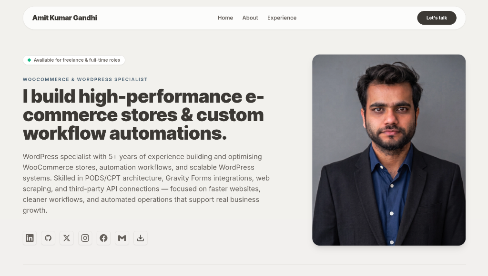

# Hi, I'm Amit Kumar Gandhi 👋
### WooCommerce Specialist | WordPress Automation & Custom Workflows

[](https://www.amitkumargandhi.com/)
[](https://www.amitkumargandhi.com/Amit%20Kumar%20Gandhi%20-%20Resume.pdf)
[](LICENSE)

---

## 🌐 Portfolio Preview

[](https://www.amitkumargandhi.com/)

👉 **Live Website:** [https://www.amitkumargandhi.com/](https://www.amitkumargandhi.com/)

---

## 🚀 About Me

I am a **WooCommerce Specialist and WordPress Integrator** with **5+ years of hands-on experience** building high-performance e-commerce platforms, custom content management systems, and automated workflow solutions.

I specialize in **PODS & CPT architecture**, **Gravity Forms integrations**, **web scraping**, and **third-party API connections** — focused on building faster websites, cleaner workflows, and automated operations that support real business growth.

---

## 🛠️ Technologies & Badges

### Core Tech & Frameworks


### WordPress & E-Commerce Specialization


### 3D Visuals & Motion Graphics


### Backend & Infrastructure


---

## 💡 Why Work With Me?

* **5+ Years of Proven Industry Expertise:** I have spearheaded end-to-end WordPress & WooCommerce integrations for companies like *vSplash Techlabs* and *AffinityX* (in collaboration with GoDaddy).
* **Custom CPT & PODS Architecture:** I don't just build basic sites — I architect custom content models, custom taxonomies, and data schemas tailored to complex business requirements.
* **Automation & Web Scraping:** I develop custom data collection tools, automated sync scripts, and Gravity Forms workflows to eliminate manual effort and streamline operations.
* **Performance & Core Web Vitals Optimization:** My sites are engineered for ultra-fast load speeds, mathematical layout comparison algorithms (TBT < 160ms), and 100% clean Cumulative Layout Shift (CLS).
* **Pixel-Perfect UI/UX:** Translating Figma designs into responsive, accessible, cross-browser compatible interfaces with interactive WebGL visual effects.

---

## ⚡ Portfolio Features

* **3D WebGL Shader Profile Avatar:** Interactive cursor-following chromatic aberration & displacement shader built with Three.js (desktop only; mobile devices use a lightweight static fallback).
* **Interactive Range-Cached Background Grid:** O(1) mathematical scroll range evaluation on dark sections to eliminate layout thrashing reflows.
* **Analytics & Privacy Integration:** Built-in Google Analytics (`gtag.js`) and SecurePrivacy cookie consent integration.
* **Direct Resume Download:** One-click download for my complete multi-page resume.

---

## 💻 Local Development

Clone the repository and install dependencies:

```bash
git clone https://github.com/iamitgandhi/portfolio-website.git
cd portfolio-website

# Install dependencies (Node 22+ recommended)
npm install

# Start local dev server
npm run dev
```

Visit `http://localhost:4321` in your browser.

---

## 📦 Production Build & Running

```bash
# Build static site bundle
npm run build

# Run local Express server (port 3000)
npm start
```

---

## ☁️ Deployment on Hostinger

This project is configured for **Hostinger Node.js Web App** deployment:

1. **Connect GitHub Repo:** In Hostinger hPanel ➔ **Node.js Web App** ➔ connect `iamitgandhi/portfolio-website`.
2. **Build Settings:**
   * **Node version:** `22.x`
   * **Package manager:** `npm`
   * **Entry file:** `server.mjs`
   * **Build command:** `npm install && npm run build`
3. **Environment Variable:** Set `SITE_URL=https://www.amitkumargandhi.com`

---

## 📬 Contact Me

* 🌐 **Website:** [www.amitkumargandhi.com](https://www.amitkumargandhi.com)
* 💼 **LinkedIn:** [linkedin.com/in/iamitgandhi](https://www.linkedin.com/in/iamitgandhi)
* 🐙 **GitHub:** [github.com/iamitgandhi](https://github.com/iamitgandhi)
* ✉️ **Email:** [sinhaamit396@gmail.com](mailto:sinhaamit396@gmail.com)
